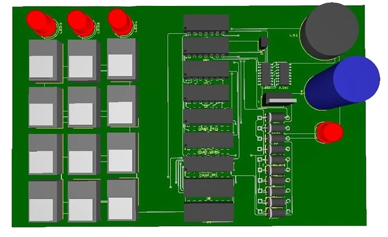
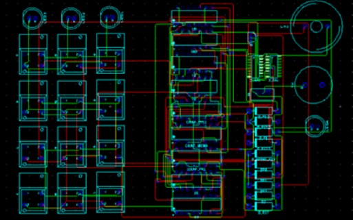
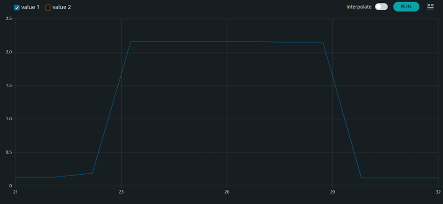
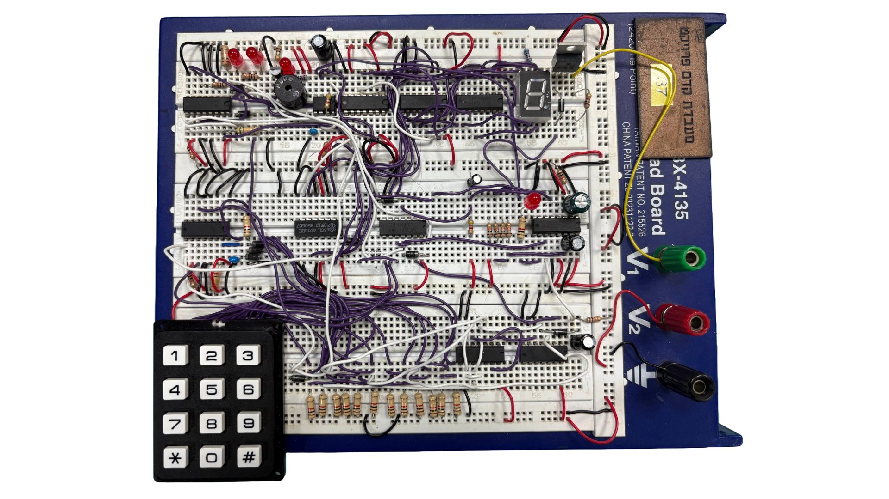

One of the most rewarding experiences during my Electrical and Electronics Engineering studies was developing an **electronic safe lock** — a system designed to open securely only when the correct three-digit code is entered. What started as a course assignment quickly evolved into a complete engineering challenge in **digital logic design, reliability, and creativity under constraints**.

---

## Project Overview

This pre-capstone project focused on designing and implementing a digital safe mechanism using **only discrete logic components**, without any microcontrollers or programmable devices.  
The system’s goal: to verify a three-digit code, signal successful or failed attempts, automatically lock after a set duration, and enforce security rules such as a buzzer alarm after repeated failed entries.

To keep the design both simple and elegant, we worked under three major constraints:

- **No programmable devices** (no Arduino, Raspberry Pi, or microcontrollers)  
- **Maximum of 15 components** across the entire system  
- **Pure logic design** — using flip-flops, counters, timers, and gates only  

This strict environment encouraged a deep understanding of how digital systems behave — from timing and synchronization to noise filtering and signal stability.

---

## System Architecture

The system was divided into **four synchronized subsystems**, each performing a specific task:

1. **Code Input & Verification** – Reads keypad input, compares it to the stored 3-digit code (the last three digits of one team member’s ID), and sends an unlock signal if correct.  
2. **Safe Opening** – When a correct code is entered, triggers an opening signal for 5 seconds, lights an LED, and displays a countdown on a 7-segment display.  
3. **Error Detection** – Detects incorrect codes, tracks failed attempts, and activates an alarm and buzzer after three consecutive errors.  
4. **Reset & Lock Control** – Allows manual reset via `*` or `#` keys, and automatically locks the safe after timeout.

<!---->

---

## Implementation Details

### Code Verification

A 12-key keypad was connected to a chain of **D flip-flops (4013)** and a **binary counter (4516)**, which recorded each input.  
A sequence detector using **AND** and **XOR gates** verified the digits `8-1-7` in that exact order.  
Noise from mechanical switches was handled with **RC filters** to stabilize pulses, ensuring clean input transitions.

<!---->

When the sequence matched, a signal was sent to enable the opening subsystem. Incorrect sequences triggered the error counter.

Additionally, keypad and other sensitive inputs were tied to ground with pull‑down resistors to prevent floating. We used 1 kΩ on the keypad lines, ~10 kΩ on the 4013 inputs for code verification, 200 kΩ and 600 kΩ on two different counter/clock nodes, and 10 kΩ on the up‑count counter inputs. Combined with RC debouncing, these values stopped spurious counts and false key presses while keeping standby current reasonable.

For a quick primer on pull‑up and pull‑down resistors, see the [SparkFun tutorial](https://learn.sparkfun.com/tutorials/pull-up-resistors).

---

### Safe Opening System

Upon correct code entry, a **monostable multivibrator (CD4538)** generated a **5-second pulse**, turning on LED1 and activating the locking mechanism through a **MOSFET IRFB7446**.  
Simultaneously, a **555 timer** and a **BCD-to-7-segment decoder (4543)** drove a countdown display.

Because the 7-segment module used a **common cathode**, we implemented logical inversion using **XOR gates** as substitutes for missing **NOT gates** — a clever hack that kept us within the component limit.
<!---->

---

### Error Handling and Security Response

The **error counter subsystem** used another **binary counter (4516)** to track incorrect entries.  
After three failed attempts, the counter triggered a **monostable 4538**, which activated both a **buzzer** and an **LED alarm** for three seconds via a **BC547 transistor**.

This system ensured both **audible and visual feedback** for excessive wrong attempts — a core security feature in real-world lock systems.

<!---->

---

### Reset & Lock Control

Reset lines were managed through **diode isolation**, allowing any subsystem to clear the state safely.  
Pressing `*` or `#` manually reset all logic elements, while the system automatically re-locked after 5 seconds of inactivity.  
The design avoided interference between components by carefully routing reset pulses through RC shaping networks.

---

## PCB Design and Fabrication

Once the full circuit worked reliably on the breadboard, we transitioned to a **PCB layout** that organized components logically:

- Keypad and LEDs on the front panel
- Counters and timers centralized for signal integrity  
- Power and I/O neatly distributed for easy testing  

The PCB’s 3D and 2D renders helped verify spatial design and connector alignment.

| 3D View | 2D Layout |
|----------|-----------|
|  |  |

---

## Testing and Verification

Testing focused on timing accuracy and fault tolerance.  
To verify timing without lab access, we used an **Arduino as a measuring instrument** — recording how long the lock stayed open after a valid code.  
The results confirmed the **5-second open interval**, stable reset behavior, and clean debouncing response.

---

## Results

- Correct code → Safe opened, LED lit, 7-segment countdown, auto-lock after 5 seconds  
- Wrong code → Warning LEDs indicated attempts  
- Three errors → Buzzer + red LED alarm for 3 seconds  
- Reset anytime → Full system reset via `*` or `#`

The safe lock functioned **exactly according to design**, remaining stable under repeated trials and immune to accidental triggers.

---

## Lessons Learned

This project demonstrated how powerful **pure logic design** can be, even without microcontrollers:

- **Digital logic can scale** — Flip-flops and counters can build entire authentication systems.  
- **Constraints encourage creativity** — Reusing XOR as NOT saved components without compromising logic.  
- **Analog meets digital** — RC filters proved vital for stable operation.  
- **Engineering is problem-solving** — Working from home, replacing missing parts, and adapting on the fly all mirrored real-world challenges.

---

## Reflections

Our digital safe lock bridged the gap between **academic theory and practical engineering**.  
It taught us how to think critically about timing, synchronization, and modular design — skills essential for larger systems such as embedded controllers and signal processors.

Ultimately, this project set the foundation for my later work in **signal processing** and **embedded systems**, such as **SonicScope**, my real-time Python-based audio analyzer.  
Both projects share the same engineering DNA: precision, creativity, and hands-on innovation.

---

*Project by Ronel Herzass and Nadav Talbi, supervised by Yair Hayon and Lidor Batzon as part of the Electrical and Electronics Engineering Pre-Capstone Project at Ariel University.*
